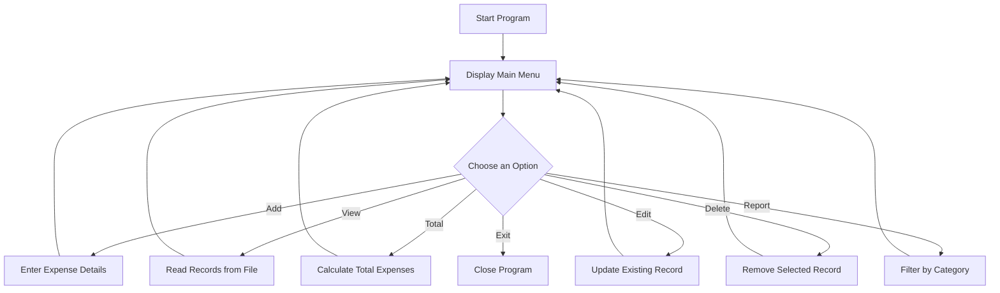

<div align="center">


<br>


<br><br>

<a href="https://github.com/Sujan-Nepal/Expense-Record-System">
  
</a>

<a href="https://github.com/Sujan-Nepal/Expense-Record-System/archive/refs/heads/main.zip">
  
</a>

</div>

---

## 📌 Project Overview

**Expense Record System** is a console-based expense management application developed using the C programming language.

The program allows users to add, view, edit, delete and analyze expense records. It uses file handling to save data permanently, which means expense records remain stored even after the program is closed.

This project was created as a first-semester BIT project to practise important C programming concepts through a practical application.

---

## 🎯 Project Purpose

The main goal of this project is to provide a simple way to manage personal or student expenses.

The system helps users:

- Keep a record of daily spending
- Organize expenses into categories
- Calculate total expenses
- Edit incorrect records
- Delete unnecessary records
- View category-based reports
- Save data permanently using files

---

## ✨ Main Features

| Feature | Description |
|---|---|
| Add Expense | Save a new expense with name, category, date and amount |
| View Expenses | Display all saved expense records |
| Calculate Total | Calculate the total amount spent |
| Edit Expense | Modify an existing expense record |
| Delete Expense | Remove an expense from the file |
| Category Report | Display expenses based on their category |
| File Storage | Save records permanently |
| Menu Interface | Navigate using a simple numbered menu |

---

## 🗂️ Supported Expense Categories

```text
Food
Travel
Entertainment
Others
```

---

## 🔄 How the System Works



---

## 🛠️ Technologies and Concepts Used

<div align="center">


</div>

<br>

This project demonstrates:

- C programming
- File handling
- Structures
- Functions
- Loops
- Conditional statements
- Menu-driven programming
- String handling
- User input validation
- Reading and writing files
- Editing stored records
- Deleting stored records

---

## 📂 Project Structure

```text
Expense-Record-System/
├── main.c
├── expenses.txt
└── README.md
```

> Replace `main.c` with your actual C source filename if it is different.

---

## 💾 Expense Data Format

Each expense is stored using this structure:

```text
Name|Category|Date|Amount
```

Example:

```text
Lunch|Food|2026-08-02|250.00
Bus Fare|Travel|2026-08-02|60.00
Movie Ticket|Entertainment|2026-08-01|450.00
```

---

# ▶️ How to Use the Project

## Method 1: Clone Using Git

Open PowerShell, Command Prompt or Terminal and run:

```bash
git clone https://github.com/Sujan-Nepal/Expense-Record-System.git
```

Move into the project folder:

```bash
cd Expense-Record-System
```

---

## Method 2: Download as ZIP

1. Open the repository.
2. Click the green **Code** button.
3. Click **Download ZIP**.
4. Extract the downloaded file.
5. Open the folder in VS Code or another C IDE.

---

# ⚙️ How to Compile and Run

## Requirements

You need:

- GCC or MinGW compiler
- VS Code, Code::Blocks or another C IDE
- Git, only when cloning the repository

---

## Compile Using GCC

Open a terminal inside the project folder:

```bash
gcc main.c -o expense-system
```

Replace `main.c` with your actual source filename.

---

## Run on Windows

```bash
.\expense-system.exe
```

---

## Run on Linux or macOS

```bash
./expense-system
```

---

## Run Using VS Code

1. Open the project folder in VS Code.
2. Install the **C/C++ extension** by Microsoft.
3. Install GCC or MinGW.
4. Open the main `.c` file.
5. Open the terminal.
6. Compile the project:

```bash
gcc main.c -o expense-system
```

7. Run it:

```bash
.\expense-system.exe
```

---

## Run Using Code::Blocks

1. Open Code::Blocks.
2. Create a new console application.
3. Select C as the programming language.
4. Replace the generated source code with the project code.
5. Click **Build and Run**.

---

## 🖥️ Example Main Menu

```text
================================================
          EXPENSE RECORD SYSTEM
================================================

1. Add Expense
2. View All Expenses
3. Calculate Total Expense
4. Edit Expense
5. Delete Expense
6. View Category Report
7. Exit

Enter your choice:
```

---

## 🧪 Example Usage

### Adding an Expense

```text
Enter expense name: Lunch
Select category: Food
Enter date: 2026-08-02
Enter amount: 250

Expense added successfully!
```

### Viewing Expenses

```text
------------------------------------------------
Name        Category      Date         Amount
------------------------------------------------
Lunch       Food          2026-08-02   250.00
Bus Fare    Travel        2026-08-02    60.00
------------------------------------------------
```

### Viewing Total Expense

```text
Total Expense: Rs. 310.00
```

---

## ⚠️ Current Limitations

The current version:

- Uses a console interface
- Stores data in a text file
- Supports predefined categories
- Does not include user accounts
- Does not include password protection
- Does not generate charts
- Does not synchronize data online

---

## 🚀 Future Improvements

Possible future upgrades:

- Graphical user interface
- Login and registration system
- Monthly and yearly expense reports
- Custom categories
- Budget limit warnings
- Expense search
- Date filtering
- Sorting by amount
- Export to CSV
- Charts and graphs
- Database storage
- Cloud synchronization
- Automatic backups
- Password protection
- Mobile or web version

---

## 📚 What I Learned

While building this project, I practised:

- Designing a complete C application
- Dividing code into reusable functions
- Working with structures
- Reading and writing text files
- Updating stored data
- Deleting records safely
- Handling user input
- Designing menu systems
- Debugging program logic
- Organizing project files
- Publishing a project on GitHub

---

## 🤝 Contributing

Contributions and suggestions are welcome.

To contribute:

1. Fork the repository.
2. Create a new branch:

```bash
git checkout -b feature-name
```

3. Make your changes.
4. Commit them:

```bash
git commit -m "Add new feature"
```

5. Push the branch:

```bash
git push origin feature-name
```

6. Open a pull request.

---

## 👨‍💻 Developer

<div align="center">

### Suzzan

BIT Student • Developer • Designer • Technology Enthusiast

<br>

<a href="https://github.com/Sujan-Nepal">
  
</a>

<a href="https://sudhanb.com.np">
  
</a>

<a href="https://www.instagram.com/suzzy.3x3">
  
</a>

</div>

---

<div align="center">

## ⭐ Support the Project

If you found the project useful, consider giving it a star.

<br>


</div>
